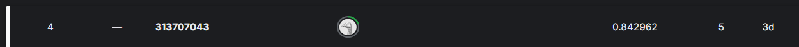

# 113-2-DeepLearning-HW1-Image-Classification
此為 113-2 工工所的深度學習的第一份作業，食物的照片分類

## Author：國立陽明交通大學 資訊管理與財務金融學系財務金融所碩一 313707043 翁智宏

本次是深度學習課程的第一次作業，是做 CNN 影像辨識模型，主要利用自己構建的 CNN 框架去完成11項食物的分類任務。

**Questions**
使用PyTorch自行設計神經網路模型，並僅使用kaggle提供的訓練資料(training data)來訓練模型參數，不得使用其他資料集進行pretrain或fine-tune等等。最後，請使用訓練後的模型來預測測試資料(testing data)的類別標籤。

## Dataset Description
- 訓練資料：共9,866張彩色圖片，每張圖片皆屬於**11個食物類別**之一
- 測試資料：共6,777張彩色圖片，需透過訓練後的模型進行分類預測 

**mmlu_sample.csv**
---
會有 **"input"、"A"、"B"、"C"、"D"、"target"、"task"** 欄位，
分別代表，**"題目"、"選項"、"答案"、"題目種類"**。

**kaggle Competition**
---
競賽連結：[點擊這裡]([https://www.kaggle.com/competitions/hw-1-prompt-engineering/overview](https://www.kaggle.com/competitions/spring-2025-semester-deep-learning-hw-1/overview)) 


> Public 準確率在 0.845302 ，Private 準確率在  (越高越精確)
> 全班共約有55人，private排名4名

 
> public 排名 名

## 模型介紹
參考了**ResNet34**、**ResNet50**、**EfficientNet**的架構，來實作CNN框架。

## 安裝依賴
請使用以下指令安裝本專案所需的依賴套件：
```bash
pip install torch torchvision scikit-learn matplotlib tqdm
```
---

## 流程
